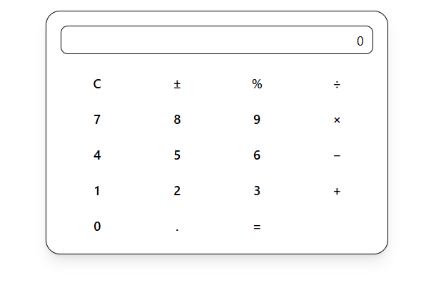

# React + TypeScript + Vite

This is a simple calculator app that takes two numbers and provide a result as required by Assignment 02.

## Technologies used

To create this tailwind css and Shadcn UI was used

## How to run it

clone the app then enter the command npm run dev

## Screenshot

